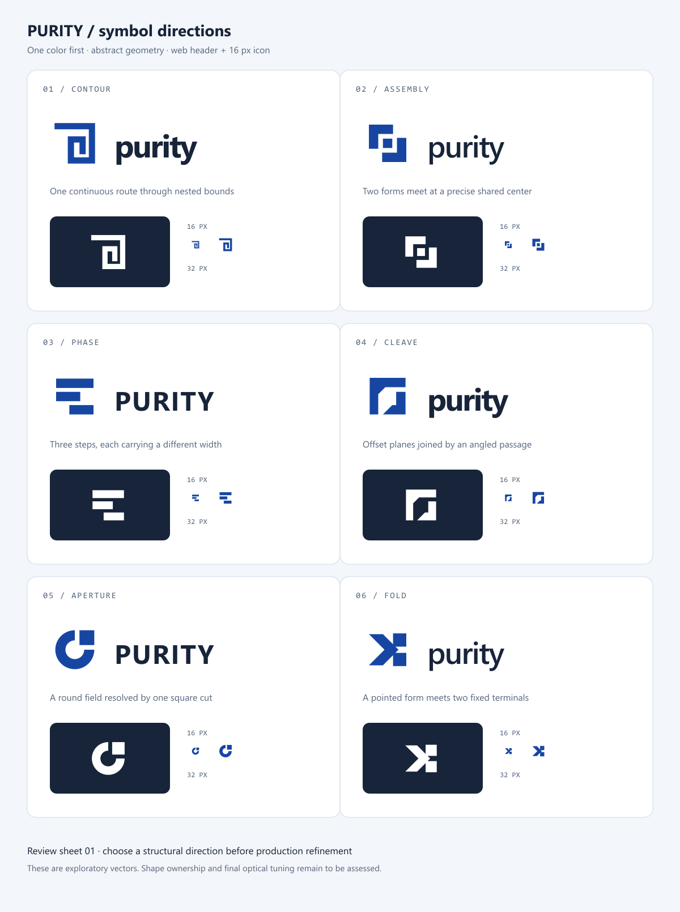

# Purity logo directions

This is a decision sheet, not a production identity. The selected direction needs optical refinement, a custom wordmark, and a final similarity review before it replaces the documentation site's current mark.

## Brief

- **Name:** Purity, displayed as `purity` in the current docs header.
- **Category:** Open-source web framework, with direct DOM rendering and signal-based updates.
- **Audience:** Developers encountering the brand in documentation, repository avatars, package listings, browser tabs, and presentation slides.
- **Tone:** Precise, restrained, modern, and approachable. The mark should feel deliberately constructed rather than decorated.
- **Constraint:** Abstract geometry; no stock circuit, atom, gradient, glowing node, or generic letter P. It must survive a single-color rendering and have a usable 16 px favicon form.
- **Existing visual system:** `#1746a2` blue, `#172439` ink, IBM Plex Sans in the docs. The sheet uses system fonts as provisional stand-ins; typography is not final.

The primary architecture is a symbol and wordmark lockup. The symbol stands alone in browser tabs, repository avatars, and square package listings. Three typographic registers are explored: compact lowercase, lighter lowercase, and spaced uppercase. The final wordmark should be custom drawn or optically adjusted to share the selected symbol's geometry.

## Six explorations

| # | Direction | Construction and intended signal | Screen result | Decision |
| --- | --- | --- | --- | --- |
| 01 | Contour | One continuous orthogonal route crosses nested bounds; suggests directness and a component boundary. | Works in one color, but the inner return becomes tight at 16 px. | Set aside. Square spirals are common in existing marks. |
| 02 | Assembly | Two opposing corner pieces align around a central square; suggests composable parts. | The center survives at 32 px and is marginal at 16 px. | Set aside. Interlocking L shapes are familiar in technology branding. |
| 03 | Phase | Three offset bars show a measured sequence; suggests incremental updates. | Crisp at 16 px, though the silhouette is commonplace. | Set aside. Too close to established three-bar marks. |
| 04 | Cleave | Two offset planes are separated by a diagonal channel; suggests a direct path through a bounded surface. | Strong one-color and reversed silhouette. The diagonal still reads at 16 px. | **Refine.** Most promising balance of character and legibility. |
| 05 | Aperture | A circular band ends in a square piece; suggests a resolved state. | The round portion reads, but the corner detail competes at 16 px. | Set aside. Similar ring-and-square marks already exist. |
| 06 | Fold | A chevron meets two square terminals; suggests a path resolving into discrete DOM nodes. | Strong silhouette at 16 px, though the small terminal gap needs tuning. | **Refine.** Distinct construction from the square variants. |

The similarity screen is an informal image search, not a trademark or design clearance. It surfaced square spiral marks, three-bar marks, and a broken ring with a detached square. The weaker directions remain on the sheet to show what was explored and rejected.

## Production notes for the two finalists

### 04 / Cleave

- **Architecture:** Horizontal lockup for the docs header; symbol-only for favicon, avatar, and compact navigation.
- **Type:** Lowercase, medium-heavy sans. Refine the `r–i–t` spacing and match the mark's diagonal angle to one custom letter detail, if that improves cohesion.
- **Geometry:** Built on a 64-unit square; broad vertical and horizontal masses with one diagonal negative channel. Keep the channel at least 2 px wide at the 16 px target size.
- **Color:** Primary blue `#1746a2`; text ink `#172439`; all-black `#000000`; reversed white `#ffffff` on dark ink.
- **Minimums:** Test the symbol at 16 and 32 px, lockup at the docs header's 29 px symbol height, and avatar at 64 px. Use a dedicated pixel-tuned 16 px favicon if the diagonal loses clarity.
- **Motion:** Reveal the two planes from the open channel, hold, then resolve to the static shape. Motion is optional for the website.

### 06 / Fold

- **Architecture:** Horizontal lockup for the docs header; symbol-only for favicon and square surfaces.
- **Type:** Lowercase, moderate weight sans. A custom angled `y` terminal could echo the symbol without turning the wordmark into an illustration.
- **Geometry:** One pointed left form and two square right terminals on a 64-unit grid. Preserve the negative gap between terminals at 16 px.
- **Color:** Same flat blue, ink, black, and reversed white tokens as Cleave; no gradient or color-dependent meaning.
- **Minimums:** Test 16 and 32 px icon renderings, 29 px docs-header symbol, and 64 px avatar. Reduce the terminal count only if a real browser favicon test shows merging.
- **Motion:** Move the pointed form toward the terminals once, then hold. No perpetual animation.

## Next decision

Choose **04 Cleave**, **06 Fold**, or ask for another direction. The next pass will refine the selected geometry and wordmark, produce light/dark SVG and PNG assets, and mock it in the live docs layout before replacing the placeholder logo files.
