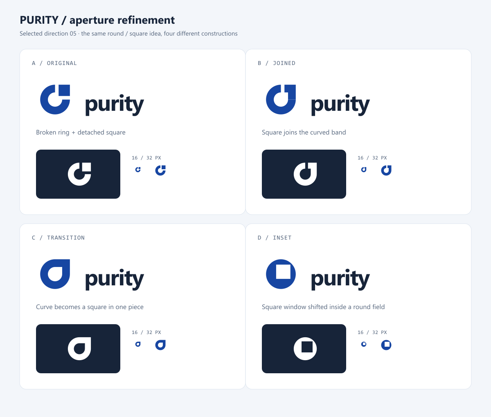

# Purity logo directions

Direction 05, Aperture, was selected. The first mark on this sheet is preserved as an exploration; the production revision is shown below.

The selected refinement is **C / Transition**: the curved band becomes a square corner in one continuous shape. The original separated square had a close visual resemblance to [RevContent's mark](https://x.com/RevContent), so it was not shipped.

## Brief

- **Name:** Purity, displayed as `purity` in the current docs header.
- **Category:** Open-source web framework, with direct DOM rendering and signal-based updates.
- **Audience:** Developers encountering the brand in documentation, repository avatars, package listings, browser tabs, and presentation slides.
- **Tone:** Precise, restrained, modern, and approachable. The mark should feel deliberately constructed rather than decorated.
- **Constraint:** Abstract geometry; no stock circuit, atom, gradient, glowing node, or generic letter P. It must survive a single-color rendering and have a usable 16 px favicon form.
- **Existing visual system:** `#1746a2` blue, `#172439` ink, IBM Plex Sans in the docs. The sheet uses system fonts as provisional stand-ins; typography is not final.

The primary architecture is a symbol and wordmark lockup. The symbol stands alone in browser tabs, repository avatars, and square package listings. Three typographic registers are explored: compact lowercase, lighter lowercase, and spaced uppercase. The final wordmark should be custom drawn or optically adjusted to share the selected symbol's geometry.

## Six explorations

| # | Direction | Construction and intended signal | Screen result | Decision |
| --- | --- | --- | --- | --- |
| 01 | Contour | One continuous orthogonal route crosses nested bounds; suggests directness and a component boundary. | Works in one color, but the inner return becomes tight at 16 px. | Set aside. Square spirals are common in existing marks. |
| 02 | Assembly | Two opposing corner pieces align around a central square; suggests composable parts. | The center survives at 32 px and is marginal at 16 px. | Set aside. Interlocking L shapes are familiar in technology branding. |
| 03 | Phase | Three offset bars show a measured sequence; suggests incremental updates. | Crisp at 16 px, though the silhouette is commonplace. | Set aside. Too close to established three-bar marks. |
| 04 | Cleave | Two offset planes are separated by a diagonal channel; suggests a direct path through a bounded surface. | Strong one-color and reversed silhouette. The diagonal still reads at 16 px. | Explored; not selected. |
| 05 | Aperture | A circular band ends in a square piece; suggests a resolved state. | The round portion reads, but the detached square resembles an existing mark. | **Selected as a direction.** Revised into one continuous shape. |
| 06 | Fold | A chevron meets two square terminals; suggests a path resolving into discrete DOM nodes. | Strong silhouette at 16 px, though the small terminal gap needs tuning. | Explored; not selected. |

The similarity screen is an informal image search, not a trademark or design clearance. It surfaced square spiral marks, three-bar marks, and a broken ring with a detached square. The weaker directions remain on the sheet to show what was explored and rejected.

## Production mark: 05 / Aperture, refinement C

- **Architecture:** Horizontal lockup for docs and other headers; symbol-only for browser tab, repository avatar, and compact navigation.
- **Construction:** On a 64-unit square, the outer contour is circular for three quadrants and square in the upper right. The inner counter follows the same transition at a smaller size. The symbol is one path and one color, with no fine detached element.
- **Wordmark:** Outlined IBM Plex Sans Semibold. Letter advances have modest negative tracking; all text is stored as vectors so the asset does not depend on an installed font.
- **Color:** Blue `#1746a2`, ink `#172439`, and white `#ffffff` for the reverse version. The shape also works in pure black.
- **Small sizes:** The dedicated favicon uses the white symbol on a blue square. The symbol remains recognizable at 16 and 32 px; use the symbol without the wordmark at those sizes.
- **Clear space:** Leave at least one quarter of the symbol's height around the outside of a standalone mark or lockup.
- **Motion:** If animated, draw the arc once and resolve into the square corner. The static form is primary.
- **Physical use:** The single filled path can be printed in one ink. Embroidery and foil stamping remain unverified and should be sampled before ordering merchandise.

The documentation header and favicon use the selected mark. The source SVGs and matching PNG exports are in this directory. A broader trademark review remains a separate step if the logo will be registered.
